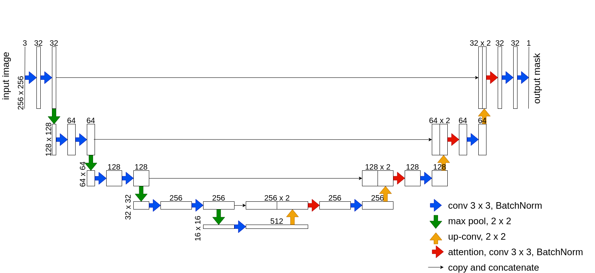

# Attention Based U-Nets
Here is a Python library of U-Nets with an implemented attention mechanism, including channel-wise attention (**Squeeze-and-Excitation**) and mixed attention (**Convolutional-Block-Attention-Module**). Also, we provide several loss functions for pixel-wise image segmentation. They are

* **Dice loss**
* **Focal loss**
* **Combined Dice and Focal loss**

and the **IoU** score metric.

## Network Architecture


The net architecture follows the design of the original U-Net, incorporates a contracting path and an expanding path. The original U-Net is defined here. We added the attention mechanism after the concatenation of copied contracting path feature maps and upsampled expanding path feature maps to enable the model to learn to weight information. The attention mechanism is located at the red arrow position you can see from the figure above.

---
## Brain Tumor Segmentation Experiment
### 1. Download and organize the dataset from [Brain MRI segmentation](https://www.kaggle.com/mateuszbuda/lgg-mri-segmentation)
```
jupyter nbconvert --execute data_prepare.ipynb
```
Note: you need to make sure your [Kaggle API](https://github.com/Kaggle/kaggle-api) is set properly.

### 2. Train the models with different loss functions.
```
python train.py --models SE_UNet Res_SE_UNet Full_SE_UNet \
                --pretrain False True False \
                --loss DiceLoss FocalLoss Dice_Focal \
                --learningrate 0.0001 \
                --epoch 50 \
                --train 5 \
                --batch 16

```
For help, you can type
```
python train.py --help
```
---
## Manual
### config.py
Global variables are defined here. You can modify the **DATA_HOME** to specify the path to store the brain tumor MRI dataset.

### data_prepare.ipynb
Including steps to download and organize the brain tumor MRI dataset.

### nets.py
Attention-based U-Net models are defined in this module. You can import them from nets.py.

### losses.py
Loss functions are defined here.

### metrics.py
The IoU metric function is defined here.

### utils.py
Utility functions are defined here, including the functions to find tumor images and to draw the segmented graphs.

### train.py
The training steps for U-Nets are defined here. train.py is designed to train several models with several loss functions in one run.

### brutal_train.py
Training steps to train one model.